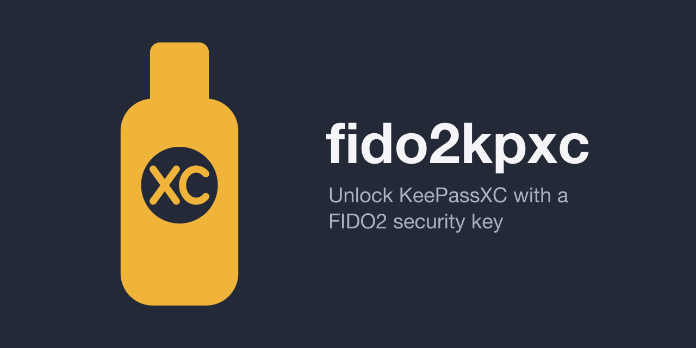

<p align="center"></p>

<p align="center">
<a href="https://github.com/BJMCox/fido2kpxc/actions/workflows/ci.yml"></a>
<a href="https://github.com/BJMCox/fido2kpxc/actions/workflows/codeql.yml"></a>
<a href="https://github.com/BJMCox/fido2kpxc/actions/workflows/release.yml"></a>
<a href="https://slsa.dev"></a>
<a href="https://github.com/BJMCox/fido2kpxc/releases/latest"></a>
<a href="https://github.com/BJMCox/fido2kpxc/releases/latest"></a>
<a href="LICENSE"></a>
</p>
<p align="center">
<a href="#requirements"></a>
<a href="https://keepassxc.org"></a>
<a href="https://fidoalliance.org"></a>
<a href="#build"></a>
<a href="#build"></a>
<a href="https://github.com/BJMCox/fido2kpxc/security/dependabot"></a>
<a href="https://github.com/BJMCox/fido2kpxc/commits/main"></a>
<a href="https://github.com/BJMCox/fido2kpxc/issues"></a>
</p>

fido2kpxc is a macOS menu-bar app that unlocks KeePassXC with a FIDO2 security key: a PIN and a touch.

When KeePassXC asks for its database password, fido2kpxc shows a PIN panel. After the PIN and a touch, it fills in the password and presses Unlock, without using the clipboard. An optional "Copy Password" menu item, off by default, is the fallback.

The vault encrypts each database password under a random data key, and each enrolled security key wraps that data key with its FIDO2 hmac-secret output. The key checks the PIN in hardware, so a wrong PIN yields nothing.

## Requirements

- macOS 13 or later on a Mac with Apple silicon
- KeePassXC 2.7 or later
- A FIDO2 security key with hmac-secret and a PIN, of any brand, for example YubiKey, Token2, or Google Titan. `enroll` refuses keys without hmac-secret. Set a PIN with the vendor's tool or in Chrome at `chrome://settings/securityKeys`.

## Install

1. Download the `.dmg` or `.pkg` from the latest release. Drag the app from the `.dmg` to Applications, or open the `.pkg`, which installs a root-owned `/Applications/fido2kpxc.app` and runs no scripts. Both are self-signed, so on first launch, right-click the app and choose Open.
2. Choose "Settings…" in the menu and set the vault folder. The vault is `<folder>/vault.toml`, so give it a folder of its own. You can also edit `~/Library/Application Support/fido2kpxc/config.toml`:

   ```toml
   folder = "~/Sync/fido2kpxc"     # required: the folder that holds vault.toml
   autofill = "fill-and-unlock"    # "off", "fill", or "fill-and-unlock"
   copy_password = false           # true shows "Copy Password" in the menu
   clear_seconds = 20              # clipboard clear delay for Copy Password, at most 3600
   ```

3. Link the command into a folder on your `PATH`. The link follows reinstalls.

   ```sh
   ln -s /Applications/fido2kpxc.app/Contents/MacOS/fido2kpxc ~/.local/bin/fido2kpxc
   ```

4. Enroll your key, either with "Set Up…" in the menu or in Terminal. Enter the database password twice and the PIN, then touch the key twice. `enroll` creates the folder if its parent exists.

   ```sh
   fido2kpxc enroll --label primary
   ```

5. Choose "Grant Accessibility…" and allow fido2kpxc in System Settings. "Start at Login" is optional.

To use the vault on another Mac, sync or copy its folder there with any tool, install fido2kpxc, and set that Mac's folder path. You don't need to enroll again.

If two Macs change the vault at once, the sync tool may keep both versions, for example as `vault.sync-conflict-….toml` (Syncthing), `vault (… conflicted copy …).toml` (Dropbox), or `vault 2.toml` (iCloud). fido2kpxc then shows a warning icon and names the file in its menu, but unlocking keeps working. Keep the file with all your keys and passwords as `vault.toml`, delete the other, and add anything missing again.

## Usage

| Command | Action |
|---|---|
| `enroll --label NAME [--database FILE]` | Create the vault with the first security key. |
| `enroll-key --label NAME` | Add a backup key, of any brand. Unlock with an enrolled key first, then swap keys. |
| `remove-key --label NAME` | Remove a key, for example a lost one, and move the vault to a new data key. Every remaining key needs a touch. |
| `check-key` | Show which enrolled key is plugged in and check that it opens every stored password. It fills nothing. Test backup keys this way now and then. |
| `set-secret [--database FILE]` | Store the password for a database file such as `pdb.kdbx`. Without `--database`, it covers every database without its own entry (`*`). |
| `remove-secret --database FILE` | Remove the password for a database file. |
| `list-keys`, `list-databases` | List the enrolled keys or the stored databases. |
| `completions zsh` | Print the zsh completion script. |
| `help`, `--help`, `-h` | Show the commands. |

Run each as `fido2kpxc <command>`. The menu's "Set Up…", "Add Security Key…", "Remove Security Key…", "Check a Security Key…", and "Set Database Password…" do the same without Terminal. "Copy Diagnostics" copies a report of what the app sees (config, vault, Accessibility, and KeePassXC's unlock screen) for bug reports. It holds no passwords or key material.

### Several security keys

With several keys plugged in, all of them blink. Touch the one to use, enter its PIN, and touch it again, as browsers do. This applies to unlocking, the menu's key actions, and the terminal commands. It needs CTAP 2.1, which current YubiKey, Token2, and Google Titan models support. With older keys, plug in only one.

### Several databases

The vault stores one password per database file name, which fido2kpxc reads from KeePassXC's unlock screen. The `*` entry covers every database without its own. Older vaults hold a single `*` entry and keep working.

If you change a database password in KeePassXC, the stored one no longer works. With `autofill = "fill-and-unlock"`, fido2kpxc notices that KeePassXC refused it, quotes KeePassXC's message, and offers to store the new password.

### Tab completion (zsh)

```sh
fido2kpxc completions zsh > ~/.zfunc/_fido2kpxc   # any folder on your $fpath
exec zsh
```

It completes commands, options, enrolled key labels, and stored database names.

## Verify a release

Each release carries signed SLSA build provenance (Build Level 3), which records that GitHub Actions built the file from this repository's tag with `build.yml`:

```sh
gh attestation verify fido2kpxc-<version>.dmg --repo BJMCox/fido2kpxc \
  --signer-workflow BJMCox/fido2kpxc/.github/workflows/build.yml
shasum -a 256 -c SHA256SUMS
```

## Limits

- fido2kpxc finds KeePassXC's unlock screen by its database path label, which works in every UI language. If a KeePassXC update changes that screen, autofill can stop. "Copy Diagnostics" shows what the app sees, and typing the password by hand always works.
- A blocked FIDO2 PIN needs a FIDO2 reset with the vendor's tool, which erases the enrollment. Enroll a backup key with `enroll-key`.

## Upgrade and uninstall

To upgrade, choose "Quit" in the menu, install the new version, and open it again. The Accessibility grant stays.

To uninstall, uncheck "Start at Login", quit fido2kpxc, run the commands below, and remove fido2kpxc from System Settings > Privacy & Security > Accessibility. The vault folder stays where you put it.

```sh
sudo rm -rf /Applications/fido2kpxc.app
sudo pkgutil --forget dev.fido2kpxc.pkg
rm -rf ~/Library/Application\ Support/fido2kpxc
```

A package copied with a sync tool, `scp`, or a USB drive has no quarantine flag, so Gatekeeper lets it install. A browser download needs approval under System Settings > Privacy & Security.

## Build

You need Rust 1.89 or later from [rustup](https://rustup.rs), and the Xcode Command Line Tools (`xcode-select --install`), because the FIDO2 crate compiles C code and packaging uses `codesign`, `pkgbuild`, and `productbuild`.

```sh
git clone https://github.com/BJMCox/fido2kpxc.git
cd fido2kpxc
cargo test
cargo build --release               # target/release/fido2kpxc, under 1 MiB
cargo run -- enroll --label test    # terminal commands during development
cargo run --release                 # the menu-bar app during development
```

Run unbundled, the app gets no Accessibility grant of its own (macOS gives it to your terminal), and "Start at Login" does not work.

### Signing identity

```sh
cargo xtask cert
```

This creates a self-signed code-signing certificate, `fido2kpxc local signing`, in your login keychain once per build Mac, and asks for your password to trust it. A second run does nothing. Check it with `security find-identity -v -p codesigning`, and remove it with `security delete-identity -c "fido2kpxc local signing"`. macOS ties the Accessibility grant to this identity rather than to the binary, so rebuilds and upgrades signed with it keep the grant. Build local packages on one Mac, so they all carry the same identity.

### App, package, and disk image

```sh
cargo xtask bundle     # target/bundle/fido2kpxc.app, signed
cargo xtask package    # dist/fido2kpxc-<version>.pkg
cargo xtask dmg        # dist/fido2kpxc-<version>.dmg, about 0.5 MB, LZMA
cargo xtask icon       # only after editing assets/*.svg; needs rsvg-convert (brew install librsvg)
```

The disk image window layout lives in `assets/dmg/DS_Store`. After changing its background or icon positions, run `cargo xtask dmg-layout`, which lays out the window with Finder and saves the file. Terminal asks once for permission to control Finder.

`codesign -d -r- target/bundle/fido2kpxc.app` should show `certificate leaf` in the designated requirement. A `cdhash` means the identity is missing. The version comes from `[workspace.package]` in `Cargo.toml`. The package installs only `/Applications/fido2kpxc.app`, with no config, vault, or scripts. Install a local package with `sudo installer -pkg dist/fido2kpxc-<version>.pkg -target /`.

### Run CodeQL locally

`cargo xtask codeql` runs the same analysis as the `codeql` workflow, with the shared config in `.github/codeql`, and fails on any finding. Run it before pushing. It needs the full CodeQL bundle, the CLI with every query pack, which GitHub's workflow uses too:

```sh
gh release download codeql-bundle-v2.27.1 -R github/codeql-action -p 'codeql-bundle-osx64.tar.zst*'
shasum -a 256 -c codeql-bundle-osx64.tar.zst.checksum.txt
mkdir -p ~/.codeql/bundle && tar -xf codeql-bundle-osx64.tar.zst -C ~/.codeql/bundle
ln -s ~/.codeql/bundle/codeql/codeql ~/.local/bin/codeql
cargo xtask codeql
```

A run takes about three minutes. Reports and databases stay in `~/Library/Caches/fido2kpxc/codeql`. Tests live in `tests.rs` files, which the config excludes because CodeQL does not recognize `#[cfg(test)]`.

### Release

1. Raise `version` under `[workspace.package]` in `Cargo.toml`, commit, and push to `main`.
2. Run `cargo xtask release`. It checks that the tree is clean, `main` matches `origin/main`, and tag `v<version>` is new, then runs the tests and pushes the tag.
3. Approve the `release` environment in GitHub Actions.

The release workflow builds the tag on a GitHub-hosted runner through the reusable workflow `.github/workflows/build.yml`. It tests, signs, and builds the `.dmg` and `.pkg`, and creates their signed provenance. The signing identity sits in the `release` environment, which only `v*` tags can use, and only after approval.

## License

Copyright 2026 Jessica Cox <jmcox@posteo.de>

Licensed under the [Apache License, Version 2.0](LICENSE). See [NOTICE](NOTICE).
