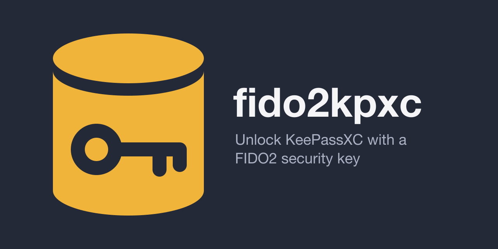

<p align="center"></p>

<p align="center">
<a href="https://github.com/BJMCox/fido2kpxc/actions/workflows/ci.yml"></a>
<a href="https://github.com/BJMCox/fido2kpxc/actions/workflows/codeql.yml"></a>
<a href="https://github.com/BJMCox/fido2kpxc/actions/workflows/release.yml"></a>
<a href="https://slsa.dev"></a>
<a href="https://github.com/BJMCox/fido2kpxc/releases/latest"></a>
<a href="https://github.com/BJMCox/fido2kpxc/releases/latest"></a>
<a href="LICENSE"></a>
<a href="#requirements"></a>
<a href="https://keepassxc.org"></a>
<a href="https://fidoalliance.org"></a>
<a href="CONTRIBUTING.md#build"></a>
<a href="CONTRIBUTING.md#build"></a>
<a href="https://github.com/BJMCox/fido2kpxc/security/dependabot"></a>
<a href="https://github.com/BJMCox/fido2kpxc/commits/main"></a>
<a href="https://github.com/BJMCox/fido2kpxc/issues"></a>
</p>

fido2kpxc is a macOS menu-bar app that unlocks KeePassXC with a FIDO2 security key.

When KeePassXC asks for its password, enter the key's PIN and touch the key. fido2kpxc fills in the password and presses Unlock, without the clipboard. An optional "Copy Password" menu item, off by default, is the fallback.

Each enrolled key wraps the vault's data key with its FIDO2 hmac-secret output. The key checks the PIN in hardware.

## Requirements

- macOS 13 or later on Apple silicon
- KeePassXC 2.7 or later
- A FIDO2 security key with hmac-secret and a PIN, of any brand, for example YubiKey, Token2, or Google Titan. `enroll` refuses keys without hmac-secret. Set a PIN with the vendor's tool or at `chrome://settings/securityKeys`.

## Install

1. Download the `.dmg` or `.pkg` from the latest release and install the app. The `.pkg` installs only `/Applications/fido2kpxc.app` and runs no scripts. The app is self-signed, not notarized by Apple, and the `.pkg` itself is unsigned, so macOS can refuse to open them the first time. If it does, click Done, open System Settings > Privacy & Security, and click "Open Anyway" under Security. Confirm with your password, then open the file again. macOS 15 and later no longer offer right-click > Open for this.
2. Choose "Set Up…" in the menu. Type a folder for the vault or pick one with "Choose…", then save. Enter the database password twice and the PIN, and touch the key twice. Leave "Database file" blank to use the password for any database, or pick the file with "Choose…".
3. The last panel offers "Start at Login" and "Grant Accessibility…". fido2kpxc needs Accessibility access to fill in KeePassXC. If you skip either, choose it later in the menu.

"Settings…" changes the settings later. They live in `~/Library/Application Support/fido2kpxc/config.toml`:

```toml
folder = "~/Sync/fido2kpxc"     # required: the folder that holds vault.toml
autofill = "fill-and-unlock"    # "off", "fill", or "fill-and-unlock"
copy_password = false           # true shows "Copy Password" in the menu
clear_seconds = 20              # clipboard clear delay for Copy Password, at most 3600
```

To use the vault on another Mac, sync its folder there. Choose "Set Up…" or "Settings…", and pick the folder or the `vault.toml` in it. You do not need to enroll again.

If a sync tool keeps two versions of the vault, such as `vault.sync-conflict-….toml`, `vault (… conflicted copy …).toml`, or `vault 2.toml`, fido2kpxc shows a warning and names the file. Keep both files until you have compared them, because each Mac may have added a key or password that the other file lacks. Each file lists its key labels and database names in plain text. Add anything missing from `vault.toml` with the menu, then delete the other copy.

## Usage

The menu covers every task. For the terminal, link the command into your `PATH`:

```sh
ln -s /Applications/fido2kpxc.app/Contents/MacOS/fido2kpxc ~/.local/bin/fido2kpxc
```

| Command | Action |
|---|---|
| `enroll --label NAME [--database FILE]` | Create the vault with the first key. |
| `enroll-key --label NAME` | Add a backup key. Unlock with an enrolled key, then swap keys. |
| `remove-key --label NAME [--label NAME ...]` | Remove one or more keys, such as lost ones, and re-key the vault. Every kept key needs a touch. |
| `check-key` | Check that the plugged-in key opens every stored password. |
| `set-secret [--database FILE]` | Store a database password. `FILE` is a file name such as `pdb.kdbx`, and a path counts as its file name. Without `--database`, it covers every database without its own entry. |
| `remove-secret --database FILE` | Remove a database password. |
| `list-keys`, `list-databases` | List the enrolled keys or the stored databases. |
| `completions zsh` | Print the zsh completion script. Save it as `_fido2kpxc` in a folder on your `$fpath`. |
| `help` | Show the commands. |

If the PIN panel does not open, for example after you cancel it, choose "Unlock KeePassXC" in the menu. "Copy Diagnostics" in the menu copies a report for bug reports. It holds no passwords or key material.

With several keys plugged in, all of them blink. Touch the one to use. This needs CTAP 2.1 authenticatorSelection. With keys that lack it, plug in only one.

Cancel on a touch panel stops the wait, but the key can blink until its own timeout. A touch in that time answers the cancelled request, so the next request needs another touch. To end the blinking at once, remove the key.

While KeePassXC offers quick unlock by Touch ID, fido2kpxc does not open the PIN panel. The PIN panel opens when KeePassXC asks for the password, such as at the first unlock or after Cancel on the Touch ID screen.

The vault stores one password per database file name, and `*` covers the rest. Two databases with the same file name share one entry. If KeePassXC refuses a stored password, fido2kpxc offers to store the new one (`fill-and-unlock` only).

## Verify a release

Each release carries SLSA Build Level 3 provenance:

```sh
gh attestation verify fido2kpxc-<version>.dmg --repo BJMCox/fido2kpxc \
  --signer-workflow BJMCox/fido2kpxc/.github/workflows/build.yml
shasum -a 256 -c SHA256SUMS
```

The release notes link each installer's VirusTotal scan.

## Limits

- The key protects the stored password, not the database. fido2kpxc adds a way to unlock, not a second factor: the database password still opens the database without the key. Keep the database password strong, and keep a copy of it outside fido2kpxc in case you lose every key.
- Every enrolled key opens every stored password.
- The password reaches KeePassXC through macOS Accessibility, so it is in memory on the Mac during each unlock.
- Key labels are not authenticated. Someone who can write the vault can swap them, but removing a key still needs a touch from every kept key.
- Every unlock needs the key's FIDO2 PIN and a touch. Keys without a PIN do not work.
- If a KeePassXC update changes its unlock screen, autofill can stop. Type the password by hand, and attach "Copy Diagnostics" to a bug report.
- A blocked PIN needs a FIDO2 reset, which erases the enrollment. Enroll a backup key.

## Recovery

To open a database, you need its password, or all of these: `vault.toml`, an enrolled key, and that key's PIN. The key alone cannot rebuild the vault, so back up the vault folder.

"Check a Security Key…" shows that a key opens the stored passwords. It does not show that they still open KeePassXC. After you change a database password, store the new one and unlock once with fido2kpxc to test it.

If you lose a key:

1. Remove it with "Remove Security Key…".
2. Change the password of each database in KeePassXC.
3. Store the new passwords with "Set Database Password…".

Old copies of the vault, such as backups or sync history, still open the old passwords with the lost key. Only step 2 makes those old passwords useless.

## Upgrade and uninstall

To upgrade, quit fido2kpxc, install the new version, and open it. The Accessibility grant stays.

To uninstall, uncheck "Start at Login", quit fido2kpxc, run the commands below, and remove fido2kpxc from System Settings > Privacy & Security > Accessibility. The vault folder stays.

```sh
sudo rm -rf /Applications/fido2kpxc.app
sudo pkgutil --forget dev.fido2kpxc.pkg
rm -rf ~/Library/Application\ Support/fido2kpxc
```

## Build from source

See [CONTRIBUTING.md](CONTRIBUTING.md).

## License

Copyright 2026 Jessica Cox <jmcox@posteo.de>

Licensed under the [Apache License, Version 2.0](LICENSE). See [NOTICE](NOTICE).
